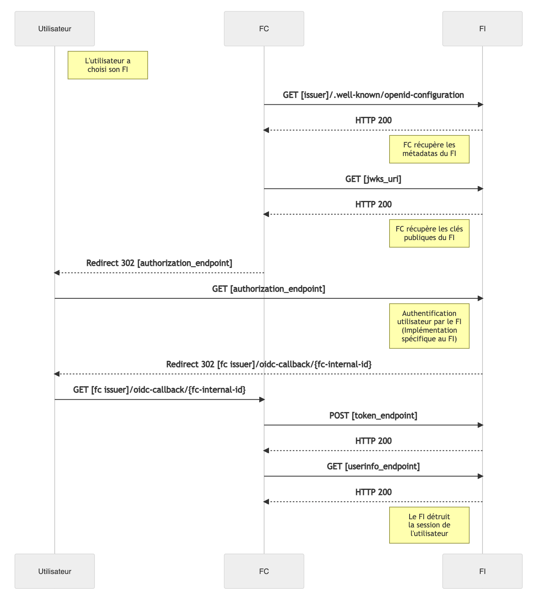
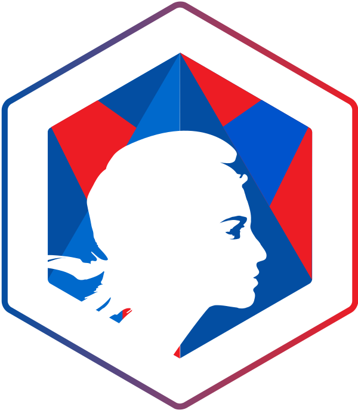

Cette documentation est à destination des fournisseurs d'identités de la plateforme FranceConnect garantissant les niveaux d'identification substantiel et élevé. 

# Concepts de base

## Le protocole OpenID Connect

### Introduction

Le protocole OpenID Connect est au coeur du fonctionnement de FC. C'est une surcouche d'identification au protocole OAuth 2.0. Il permet à des Clients (ici, les FS) d'accéder à l'identité des Utilisateurs finaux (les internautes) par l'intermédiaire d'un serveur d'autorisation (ici, les FIs).

Les FS doivent donc être des clients OpenID Connect (aussi appelés relying parties), et les FIs doivent être des fournisseurs OpenID Connect (aussi appelés providers).

La spécification du protocole se trouve sur http://openid.net/connect/.

Pour une référence d'implémentation OpenID Connect voici le lien : https://openid.net/specs/openid-connect-core-1_0.html#CodeFlowAuth

### Les flux standards

Le protocole OpenID Connect définit 3 appels REST faits par le client, et 4 endpoints (un du côté client, et trois du côté provider).

En amont, le client s'inscrit (en général manuellement) auprès du provider. Il lui fournit une URL de callback (l'URL du client vers lequel l'internaute est redirigé une fois authentifié), aussi appelée "callback endpoint". En retour le provider donne au client un client ID et un client secret.

Lorsque l'internaute clique sur le bouton d'authentification du client, le flux est le suivant :

Le client fait une redirection vers le "authorization endpoint" du provider avec son client id et son url de callback. Le provider redirige alors l'internaute vers sa mire d'authentification. Si l'internaute se loggue correctement, le provider renvoie un code d'autorisation au client.
Le client fait un appel Web service vers le "token endpoint" du provider avec le code d'autorisation reçu, et authentifie cette requête avec son client id et son client secret. Le provider retourne un access token (une chaîne de caractères encodée en base64), un id token (sous la forme d'un Json Web Token, voir https://developer.atlassian.com/cloud/jira/service-desk/understanding-jwt/), et parfois un refresh token (une chaîne de caractères en base64).
Le client fait un appel Web service vers le "userInfo endpoint" du provider avec l'access token reçu, et le provider renvoie les informations de l'internaute au client.

### Dans le cadre de FranceConnect

FranceConnect implémente le flux [Authorization Code Flow](https://openid.net/specs/openid-connect-core-1_0.html#CodeFlowAuth) d'OpenID Connect. 

Les fournisseurs de service doivent être clients OpenID Connect, et les fournisseurs d'identité doivent être fournisseurs OpenID Connect. FranceConnect est une brique intermédiaire qui est à la fois fournisseur (du point de vue des FS) et client (du point de vue des FI).

### Chiffrement et signature des échanges

Tous les échanges de jetons JWT entre le FI et FC sont signés et chiffrés en utilisant les algorithmes suivants : 

**Signature de jetons par le FI** :

- Asymétrique : 

       - ES256 (EC + SHA256)
       - RS256 (RSA + SHA256)

**Chiffrement des jetons (jwe+jws)** :

- Hybride :

      - RSA-OEAP + AES256-GCM
      - RSA-OEAP-256 + AES256-GCM 
      - ECDH-ES + AES256-GCM

Les spécifications des algorithmes de signatures et de chiffrements utilisés sont les suivants : 
* [JWA - https://tools.ietf.org/html/rfc7518](https://tools.ietf.org/html/rfc7518)
* [JWS - https://tools.ietf.org/html/rfc7515#appendix-A.3](https://tools.ietf.org/html/rfc7515#appendix-A.3)
* [JWE - https://tools.ietf.org/html/rfc7516#appendix-A.1](https://tools.ietf.org/html/rfc7516#appendix-A.1)

Les clés publiques de chiffrement de FranceConnect sont disponibles à l'adresse suivantes et sont changées régulièrement :

| Environnement | adresses du endpoint |
| ------ | ------ |
| intégration FC | https://auth.integ01.dev-franceconnect.fr/api/v2/client/.well-known/keys |
| production FC | https://auth.franceconnect.gouv.fr/api/v2/client/.well-known/keys |  

les clés de signatures utilisés par le Fournisseur d'Identité doivent être disponible via la *JWKS URL* présente dans les méta-data de la *Discovery URL* . 

## Les données utilisateur

### L'identité pivot

L'identité pivot fait partie des données usagers fournies par les Fournisseurs d'Identité aux Fournisseurs de Service, via FranceConnect+ . Elle permet d'identifier un utilisateur particulier.

| Claim        | Obligatoire | Type   | Description                                                                                                |
|--------------|-------------|--------|------------------------------------------------------------------------------------------------------------|
| given_name   | oui         | string | les prénoms séparés par des espaces (standard OpenIDConnect)                                               |
| family_name  | oui         | string | le nom de famille de naissance (standard OpenIDConnect)                                                    |
| birthdate    | oui         | string | la date de naissance au format YYYY-MM-DD (standard OpenIDConnect), au format YYYY-MM-00 ou YYYY-00-00 pour les présumés nés                                         |
| gender       | oui         | string | male pour les hommes, female pour les femmes (standard OpenIDConnect)                                      |
| birthplace   | oui         | string | le code INSEE du lieu de naissance sur 5 chiffres (ou une chaîne vide si la personne est née à l'étranger) |
| birthcountry | oui         | string | le code INSEE du pays de naissance sur 5 chiffres                                                          |

### Les données complémentaires

| Claims             | Obligatoire | Type   | Description                                                               |
|--------------------|-------------|--------|---------------------------------------------------------------------------|
| sub                | oui         | string | identifiant technique (standard OpenIDConnect)                            |
| email              | oui         | string | l'adresse électronique de contact de la personne (standard OpenIDConnect) |
| preferred_username | non         | string | le nom d'usage (standard OpenIDConnect)                                   |

### Les scopes demandés au fournisseur d'identité par FranceConnect+

Lorsque FranceConnect+ initie une cinématique auprès du fournisseur de service, les scopes demandés sont les suivants : 

- openid 
- profile 
- email 
- preferred_username 
- birthplace 
- birthcountry 

[Scopes dans les spécifications OpenID Connect](https://openid.net/specs/openid-connect-core-1_0.html#ScopeClaims)

# Je veux être fournisseur d'identité FranceConnect
Pour devenir fournisseur d'identité FranceConnect, envoyer votre demande à l'adresse support.partenaires@franceconnect.gouv.fr avec les éléments suivants :

* Nom du fournisseur d'identité
* Titre (tel qu'il apparaîtra aux utilisateurs FC)
* Email de contact
* URL du endpoint d'authentification et d'autorisation
* URL du endpoint de demande de token
* URL du endpoint de demande des informations ut[ilisateur (identité pivot)
* URL du endpoint de logout ( norme OIDC )
* URL de endpoint de métadonnée '.well-known/openid-configuration'
* Status URL (URL pour tester l'état du FI)
* Client ID
* Client secret
* Niveau eidas ( eidas2 - substantiel, eidas3 - élevé)
* Logo

## Nos Endpoints

En environnement d'intégration, production de FranceConnect, les endpoints sont disponibles en HTTPS.

FranceConnect doit être capable d'interroger le FI. Pensez à configurer votre proxy, si nécessaire, pour autoriser l'accès Internet depuis FC.

| Environnement | Adresse de retour ( Redirect URI ) |
| ------ | ------ |
| intégration FC | https://auth.integ01.dev-franceconnect.fr/api/v2/oidc-callback/{fc-internal-id} |
| production FC | https://auth.franceconnect.gouv.fr/api/v2/oidc-callback/{fc-internal-id} |  

La valeur `{fc-internal-id}` est spécifique à chaque fournisseur d'identité et sera fournie par FranceConnect.

## Détail du fonctionnement

Les access token fournis par le FI doivent être de préférence à usage unique ou si cela n'est pas possibile avec une durée de vie très courte [https://openid.net/specs/openid-connect-core-1_0.html#rfc.section.16.18](https://openid.net/specs/openid-connect-core-1_0.html#rfc.section.16.18)

## Détail des flux

Les flux entre FC et le FI respectent ce qui est défini dans la norme OpenId Connect. Pour plus de détails, il faut se référer à la [documentation OIDC - https://openid.net/specs/openid-connect-core-1_0.html#CodeFlowAuth](https://openid.net/specs/openid-connect-core-1_0.html#CodeFlowAuth)

## Utiliser les niveaux eIDAS en tant que FI

EIDAS est un standard européen visant à normaliser et à améliorer la sécurité de l'identification sur Internet. Il propose notamment 3 niveaux de garantie sur les moyens utilisés pour l'identification. En tant que FI, il est nécessaire de retourner à FranceConnect le niveau eIDAS avec lequel l'utilisateur vient de s'authentifier.

De manière analogue à ce qui est fait pour demander un FI réputé utiliser un niveau eIDAS particulier à France Connect (cf la section correspondante dans la documentation FS), le FI doit signifier à FranceConnect avec quel niveau eIDAS l'authentification s'est faite. 

Dans le cadre du FI, cela se traduit par le fait de positionner le claim "acr" dans l'ID Token renvoyé au client (http://openid.net/specs/openid-connect-core-1_0.html#rfc.section.2). De la même manière que pour un FS demandant à FranceConnect de filtrer les FIs réputés compatibles avec un niveau eIDAS particulier, le claim acr retourné dans l'ID Token peut être :

* eidas2 : niveau substantiel 
* eidas3 : niveau élevé 

Cette donnée est retournée à FranceConnect, qui lui même la retourne au FS et au FD (sans la modifier).

Il existe un autre niveau, eidas1 : niveau faible , mais n'est pas pris en compte par la plateforme FranceConnect garantissant un niveau d'identification substantiel ou élevé

Cette donnée est retournée à FranceConnect, qui lui même la retourne au FS et au FD (sans la modifier).

# La gestion d'erreurs : en tant que FI, quelles erreurs renvoyer à FC?

En tant que FI,  il est nécessaire de retourner les informations d'erreur à FranceConnect (s'il y en a) par l'URL de callback fournie en utilisant le formalisme se trouvant dans la norme [http://openid.net/specs/openid-connect-core-1_0.html#AuthError](http://openid.net/specs/openid-connect-core-1_0.html#AuthError).

# Parcours d'utilisation de l'usager et recommandations UX

La mire de connexion du fournisseur d'identité doit tout d'abord être responsive, afin d'être utilisable sur mobile.

Les éléments suivants y sont obligatoires, afin d'éviter l'abandon de l'usager lors d'une cinématique FranceConnect :

* Lien de contact du support du fournisseur d'identité, redirigeant vers une FAQ affichant un numéro à contacter ou un email par exemple.
* Lien de création de compte, redirigeant vers une page permettant de créer un compte chez le fournisseur d'identité.
* Lien de mot de passe oublié.

Pour une meilleure compréhension de la présence du fournisseur d'identité dans l'écosystème FranceConnect, nous imposons également les éléments suivants sur la mire de connexion du fournisseur d'identité :

Fond grisé avec Marianne en blanc en bas à droite.
Logos de FranceConnect et du fournisseur d'identité.
Lien "retourner sur FranceConnect" pour permettre le changement de fournisseur d'identité à l'usager.

Ci-dessous les éléments visuels nécessaires :

Téléchargements :

* [Pack png](img/fc_images_png.zip)
* [Pack jpg](img/fc_images_jpg.zip)

Le parcours d’identification doit être validé par l’équipe FranceConnect le plus en amont possible de la réalisation sous la forme suivante : 
* communication des maquettes ou spécifications fonctionnelles
* qualification du parcours d’identification en environnement d'intégration

Ces deux étapes sont des pré-requis à une ouverture en production. 

L’équipe FranceConnect est là pour vous aider à proposer l’expérience usager la plus adaptée. N'hésitez pas à la solliciter pour éviter d'impacter vos délais de mise en production.

# Glossaire

Le glossaire relatif à OpenId Connect est spécifié à l'adresse [https://openid.net/specs/openid-connect-core-1_0.html#rfc.section.1.2](https://openid.net/specs/openid-connect-core-1_0.html#rfc.section.1.2)

