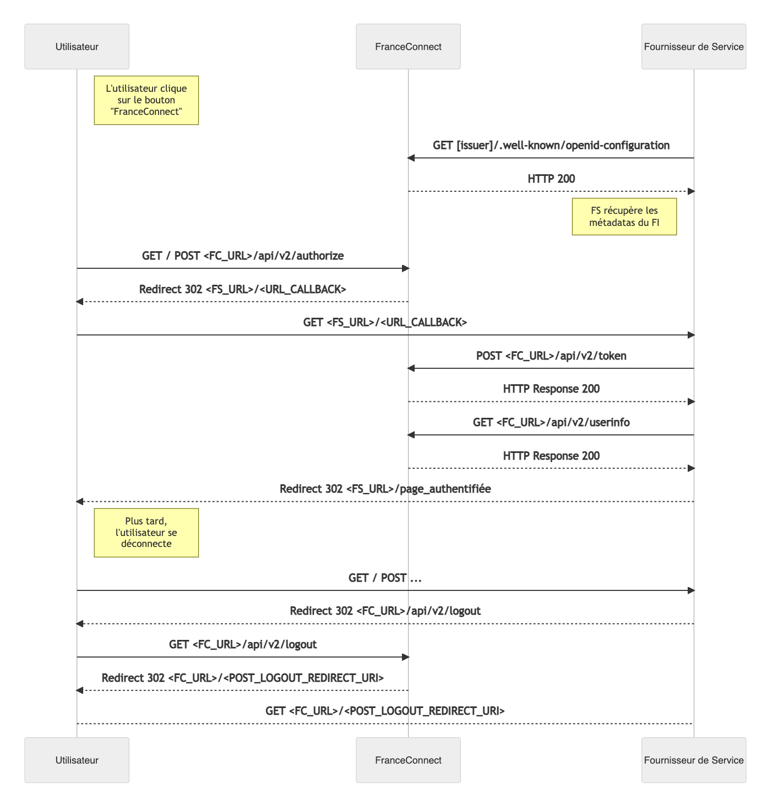

# Préambule

Cette documentation est à destination des Fournisseurs de Service souhaitant intégrer FranceConnect+. 
FranceConnect+ met à disposition du Fournisseur de Service des identités de niveau de garantie eIDAS Susbtantiel et Elevé. 
FranceConnect+ s'implémente sur une plateforme distincte de la plateforme dite "Standard" qui reste dédiée aux identités de niveau de garantie "faible".

# Je veux devenir Fournisseur de Service 

## Quelles sont les étapes pour devenir Fournisseur de Service ? 

1. Vous consultez les conditions d'éligibilité à FranceConnect+. Les conditions juridiques, de sécurité et de qualité de service sont détaillées dans nos [conditions générales d'utilisation](https://partenaires.franceconnect.gouv.fr/cgu). Le cadre d'implémentation et d'intégration est détaillé dans nos [spécifications ergonomiques](https://partenaires.franceconnect.gouv.fr/fcp/fournisseur-service#acceptance) **TODO** *mettre à jour le lien* .

2. Vous soumettez une demande d'habilitation  via [datapass.api.gouv.fr](https://datapass.api.gouv.fr/) et vous transmettez toutes les informations nécessaires à la validation de votre demande (respect du RGPD, contact du responsable technique, niveau de garantie eIDAS souhaité, données d'identité recueillies, etc). Votre demande est validée par le service juridique de la DINUM dans un délai moyen de 5 jours ouvrés.

3. Si votre demande est acceptée, vous devez faire une demande pour pouvoir accéder à l'environnement d'intégration FranceConnect+. Celui-ci vous permettra de réaliser vos développements. Pour faire votre demande, il est nécessaire d'utiliser la démarche en ligne suivante : https://www.demarches-simplifiees.fr/commencer/demande-de-creation-d-un-fs-fc-plus.

4. Vous présentez vos développements pour une qualification par l'équipe FranceConnect+. La durée de cette phase de qualification dépend du [respect des prérequis ](https://partenaires.franceconnect.gouv.fr/monprojet/recetter/)(techniques, sécurité, fonctionnels, UX...). N'hésitez pas à soumettre vos maquettes de parcours en amont pour une pré-qualification fonctionnelle et UX anticipée. Pour faire votre demande, il est nécessaire d'utiliser la démarche en ligne suivante : https://www.demarches-simplifiees.fr/commencer/demande-qualification-fs-fcplus

5. Si votre implémentation est validée par notre équipe, vous recevez vos secrets pour passer en production. Pour cela, il est nécessaire d'utiliser la démarche en ligne suivante pour les demander : https://www.demarches-simplifiees.fr/commencer/demande-de-creation-d-un-fs-fc-plus

## Accès à l'environnement d'intégration FranceConnect+

Pour vous permettre de réaliser les développements liés à  l'intégration de FranceConnect+, nous mettons à disposition un environnement d'intégration. Les accès à cet environnement se font à travers des clés qui vous sont communiquées sur votre espace partenaire. 

Sur notre environnement d'intégration, vous pouvez utiliser le fournisseur d'identité "Démonstration" dont les données sont modifiables ici : https://github.com/france-connect/identity-provider-example/blob/master/database.csv

Vous pouvez proposer de nouvelles identités de tests directement sur ce fichier.

Les adresses de notre environnement d'intégration sont les suivantes : 

| EndPoint | Adresse |
| ------ | ------ |
| Discovery URL | https://auth.integ01.dev-franceconnect.fr/api/v2/.well-known/openid-configuration | 
| Authorization | https://auth.integ01.dev-franceconnect.fr/api/v2/authorize |
| Token | https://auth.integ01.dev-franceconnect.fr/api/v2/token | 
| UserInfo | https://auth.integ01.dev-franceconnect.fr/api/v2/userinfo | 
| Logout | https://auth.integ01.dev-franceconnect.fr/api/v2/session/end | 

## Mettre en production mon Fournisseur de Service

Pour mettre en production votre Fournisseur de Service, il faut au préalable avoir : 

1. Reçu la qualification de vos développements par FranceConnect+ sur un environnement autre que votre production. 
2. Demandé une mise en production à travers votre [espace partenaire]((https://partenaires.franceconnect.gouv.fr/login)) 
3. Utilisé les clés de production qui vous ont été fournies par FranceConnect. 

**Attention :** Il ne faut surtout pas utiliser les clés d'intégration que vous avez utilisées lors de vos développements avec votre Fournisseur de Service en production. Les clés d'intégration ne sont utilisables que sur l'environnement d'intégration FranceConnect.

Les adresses de notre environnement de production sont les suivantes : 

| EndPoint | Adresse |
| ------ | ------ |
| Discovery URL | https://auth.franceconnect.gouv.fr/api/v2/.well-known/openid-configuration | 
| Authorization | https://auth.franceconnect.gouv.fr/api/v2/authorize |
| Token | https://auth.franceconnect.gouv.fr/api/v2/token | 
| UserInfo | https://auth.franceconnect.gouv.fr/api/v2/userinfo | 
| Logout | https://auth.franceconnect.gouv.fr/api/v2/session/end | 


## Réaliser des tests avant de soumettre sa demande d'habilitation

Un fournisseur de Service de démonstration est disponible à l'adresse  [https://fsp1v2.integ01.fcp.fournisseur-de-service.fr/](https://fsp1v2.integ01.fcp.fournisseur-de-service.fr/). 

# Concepts de base
## Le protocole OpenID Connect
### Introduction

Le protocole OpenID Connect est au cœur du fonctionnement de FranceConnect. C'est une couche d'identification basée sur protocole OAuth 2.0. Il permet à des Clients (ici, les Fournisseur de Service) d'accéder à l'identité des Utilisateurs finaux (les internautes) par l'intermédiaire d'un serveur d'autorisation (ici, les Fournisseurs d'Identité).

La spécification du protocole se trouve sur http://openid.net/connect/.

Pour une référence d'implémentation OpenID Connect voici le lien : https://openid.net/specs/openid-connect-core-1_0.html#CodeFlowAuth

### Les flux standards

Le protocole OpenID Connect définit 3 appels REST faits par le client, et 4 endpoints (un du côté client, et trois du côté provider).

En amont, le client s'inscrit (en général manuellement) auprès du provider. Il lui fournit une URL de callback (l'URL du client vers lequel l'internaute est redirigé une fois authentifié), aussi appelée "callback endpoint". En retour le provider donne au client un client ID et un client secret.

Lorsque l'internaute clique sur le bouton d'authentification du client, le flux est le suivant :

1. Le client fait une redirection vers le "authorization endpoint" du provider avec son client id et son url de callback. Le provider redirige alors l'internaute vers sa mire d'authentification. Si l'internaute se loggue correctement, le provider renvoie un code d'autorisation au client.
2. Le client fait un appel Web service vers le "token endpoint" du provider avec le code d'autorisation reçu, et authentifie cette requête avec son client id et son client secret. Le provider retourne un access token (une chaîne de caractères encodée en base64), un id token (sous la forme d'un Json Web Token), et parfois un refresh token (une chaîne de caractères en base64).
3. Le client fait un appel Web service vers le "userInfo endpoint" du provider avec l'access token reçu, et le provider renvoie les informations de l'internaute au client.

### Dans le cadre de FranceConnect

L'enregistrement des Fournisseurs de Service auprès de FranceConnect+ s'effectue en déposant une demande sur le site [datapass.api.gouv.fr](https://datapass.api.gouv.fr/)

FranceConnect+ implémente le flux [Authorization Code Flow](https://openid.net/specs/openid-connect-core-1_0.html#CodeFlowAuth) d'OpenID Connect. 

Les fournisseurs de service doivent être clients OpenID Connect, et les fournisseurs d'identité doivent être fournisseurs OpenID Connect. FranceConnect+ est une brique intermédiaire qui est à la fois fournisseur (du point de vue des FS) et client (du point de vue des FI).

### Chiffrement et signature des échanges

Tous les échanges de jetons JWT entre FranceConnect+ et le Fournisseur de Service sont signés et chiffrés en utilisant les algorithmes suivants :

**Signature de jetons par le FranceConnect+** :

- Asymétrique : 

       - ES256 (EC + SHA256)

**Chiffrement des jetons (jwe+jws) par FranceConnect+** :

- Hybride :

      - RSA-OEAP + AES256-GCM 
      - ECDH-ES + AES256-GCM

Les spécifications des algorithmes de signatures et de chiffrements utilisés sont les suivantes :

* [JWA - https://tools.ietf.org/html/rfc7518](https://tools.ietf.org/html/rfc7518)
* [JWS - https://tools.ietf.org/html/rfc7515#appendix-A.3](https://tools.ietf.org/html/rfc7515#appendix-A.3)
* [JWE - https://tools.ietf.org/html/rfc7516#appendix-A.1](https://tools.ietf.org/html/rfc7516#appendix-A.1)

Les clés publiques de signatures de FranceConnect+ sont disponibles via la *JWKS URL* présente dans les méta-data de la *Discovery URL* à l'adresse suivantes et sont changées régulièrement :

| Environnement | adresses du endpoint |
| ------ | ------ |
| intégration FC | https://auth.integ01.dev-franceconnect.fr/api/v2/jwks |
| production FC | https://auth.franceconnect.gouv.fr/api/v2/jwks |  

les clés de signatures utilisés par le Fournisseur d'Identité doivent être disponible via la *JWKS URL* présente dans les méta-data de la *Discovery URL* . 

## Les données usagers
Les données usagers sont fournies par les Fournisseurs d'Identité aux Fournisseurs de Service, via FranceConnect, conformément à l'habilitation obtenue via [datapass.api.gouv.fr](https://datapass.api.gouv.fr), et le choix des données réalisé par le fournisseur de service dans cette demande.

L'identité pivot permet d'identifier un utilisateur particulier.

* Nom de naissance
* Prénoms
* Sexe
* Date de naissance
* Code géographique INSEE de la ville de naissance
* Code géographique INSEE du pays de naissance

En complément, il est possible d'obtenir le nom d'usage. Cependant cette donnée n'est pas obligatoirement connue par tous les Fournisseurs d'Identité.

Vous pouvez avoir accès également à l'adresse email. Cette donnée de contact a également été vérifiée par le Fournisseur d'identité. Il est à remarquer que la donnée "adresse email" peut différer selon le Fournisseur d'Identité choisi par l'usager.

FranceConnect+ transmet systématiquement au Fournisseur de Service un identifiant unique pour chaque utilisateur : 

* Cet identifiant est spécifique à chaque Fournisseur de Service. Un même utilisateur aura donc un identifiant unique différent pour chacun des Fournisseurs de Service auxquels il accède. 
* Cet identifiant est le même quelque soit le Fournisseur d'Identité qui est utilisé par l'utilisateur. 

A noter que pour les niveaux de garantie d'identité eIDAS 2 et 3 (substantiel et élevé), les données d'identité fournies au fournisseur de service sont celles directement issues du fournisseur d'identité choisi par l'utilisateur, sans redressement RNIPP (INSEE). Ces données peuvent donc légèrement varier d'un fournisseur d'identité à l'autre, nous préconisons donc de réaliser le rapprochement/réconciliation sur la base de l'identifiant unique de l'utilisateur fourni par FranceConnect.


### Liste des scopes disponible lors de l'étape d'authentification FranceConnect

FranceConnect+ a étendu le mécanisme de scopes pour qu'il soit plus modulaire.

* Un seul scope est obligatoire : openid. Il permet de récupérer le sub (identifiant unique technique) de l'utilisateur.
* Il est possible de récupérer individuellement chaque propriété de l'identité pivot en utilisant leurs scopes dédiés.
* Il est possible de combiner plusieurs scopes de son choix pour récupérer seulement les informations dont a besoin le FS.


| Champs       | Type   | Description | Format |
|--------------|--------|-------------|--------|
| given_name   | string | les prénoms séparés par des espaces (standard OpenIDConnect) | [A-Za-zÀÂÄÇÉÈÊËÎÏÔÖÙÛÜŸàâäçéèêëîïôöùûüÿÆŒæœ -'] |                                             |
| family_name  | string | le nom de famille de naissance (standard OpenIDConnect) |  [A-ZÀÂÄÇÉÈÊËÎÏÔÖÙÛÜŸÆŒ \-']|                                                 |
| birthdate    | string | la date de naissance au format YYYY-MM-DD (standard OpenIDConnect)                                    | [ YYYY-01-01 ] - (\d{4})-01-01 - (Présumé mois) [ YYYY-MM-01 ] - (\d{4})-(\d{2})-01 - (Présumé jours) [ YYYY-MM-DD ] - (\d{4})-(\d{2})-(\d{2}) |
| gender       | string | male pour les hommes, female pour les femmes (standard OpenIDConnect)| Masculin : male ; Féminin : female |  
| birthplace   | string | le code INSEE du lieu de naissance sur 5 chiffres (ou une chaîne vide si la personne est née à l'étranger) | Si né en France (Taille de 5) [(([0-8][0-9AB])|(9[0-8AB]))[0-9]{3}] - [Details] - [Liste] En cas de pays étranger : Champs vide | 
| birthcountry | string | le code INSEE du pays de naissance sur 5 chiffres    | Pour les pays étrangers (Taille de 5 ) [99[0-9]{3}] - [Details] Pour la France 99100  |

### Les données complémentaires

| Champs       | Type   | Description | Format |
|--------------|--------|-------------|--------|
| sub          | string | identifiant technique (standard OpenIDConnect) | 66 caractères hexa + lettre 'v' |
| email        | string | l'adresse électronique de contact de la personne (standard OpenIDConnect) | RFC 5322 |
| preferred_username | string | le nom d'usage (standard OpenIDConnect) | [A-ZÀÂÄÇÉÈÊËÎÏÔÖÙÛÜŸÆŒ \-'] |

### Les "alias"

**profile :** Regroupe les scopes given_name, family_name, preferred_username, birthdate et gender. Si disponible, renvoie aussi preferred_username

**birth :** Regroupe les scopes birthplace et birthcountry. Permet de récupérer la ville et le pays de naissance de la personne.

**identite_pivot :** Regroupe les scopes given_name, family_name, birthdate, gender, birthplace, birthcountry. Permet de récupérer l'identité pivot complète.

Cette liste de scopes est définie par la norme OpenIDConnect : http://openid.net/specs/openid-connect-core-1_0.html#ScopeClaims


### Les données provenant du RNIPP

Il est possible également de récupérer pour chacune des données d'identités, de récupérer la même donnée provenant du RNIPP. Ces données doivent être uniquement utilisées pour faciliter le rapprochement en l'identité provenant de FranceConnect+ avec celle dans le référentiel du fournisseur de service. Ces données ne présentent pas le même niveau de garantie que les données d'identités. Elles doivent donc être utilisé uniquement pour facilité la réconciliation. Les données provenant du fournisseurs d'identités sont les seules ayant le niveau de garantie demandé ( subtantiel ou élevé ). 

Des scopes spécifiques permettant de récupérer à la fois les données provenant du RNIPP et du fournisseurs d'identités ont été ajoutés. 

| scope | claims associés |
| ------ | ------ |
| rnipp_given_name | given_name, rnipp_given_name |
| rnipp_family_name | family_name, rnipp_family_name |
| rnipp_gender | gender, rnipp_gender |
| rnipp_birthcountry | birthcountry, rnipp_birthcountry |
| rnipp_birthplace | birthplace, rnipp_birthplace |
| rnipp_birthdate | birthdate, rnipp_birthdate |
| rnipp_profile | given_name, family_name, birthdate, gender,preferred_username,rnipp_given_name, rnipp_family_name, rnipp_birthdate, rnipp_gender |
| rnipp_birth | birthplace, birthcountry, rnipp_birthplace, rnipp_birthcountry |
| rnipp_identite_pivot | given_name, family_name, birthdate, gender, birthplace, birthcountry, rnipp_given_name, rnipp_family_name, rnipp_birthdate, rnipp_gender, rnipp_birthplace, rnipp_birthcountry|

Des claims supplémentaires contiennent les données provenant du RNIPP

| Champs       | Type   | Description | Format |
|--------------|--------|-------------|--------|
| rnipp_given_name   | string | les prénoms séparés par des espaces (standard OpenIDConnect) | [A-Za-zÀÂÄÇÉÈÊËÎÏÔÖÙÛÜŸàâäçéèêëîïôöùûüÿÆŒæœ -'] |                                             |
| rnipp_family_name  | string | le nom de famille de naissance (standard OpenIDConnect) |  [A-ZÀÂÄÇÉÈÊËÎÏÔÖÙÛÜŸÆŒ \-']|                                                 |
| rnipp_birthdate    | string | la date de naissance au format YYYY-MM-DD (standard OpenIDConnect)                                    | [ YYYY-01-01 ] - (\d{4})-01-01 - (Présumé mois) [ YYYY-MM-01 ] - (\d{4})-(\d{2})-01 - (Présumé jours) [ YYYY-MM-DD ] - (\d{4})-(\d{2})-(\d{2}) |
| rnipp_gender       | string | male pour les hommes, female pour les femmes (standard OpenIDConnect)| Masculin : male ; Féminin : female |  
| rnipp_birthplace   | string | le code INSEE du lieu de naissance sur 5 chiffres (ou une chaîne vide si la personne est née à l'étranger) | Si né en France (Taille de 5) [(([0-8][0-9AB])|(9[0-8AB]))[0-9]{3}] - [Details] - [Liste] En cas de pays étranger : Champs vide | 
| rnipp_birthcountry | string | le code INSEE du pays de naissance sur 5 chiffres    | Pour les pays étrangers (Taille de 5 ) [99[0-9]{3}] - [Details] Pour la France 99100  |

# Je veux identifier/authentifier des utilisateurs via FranceConnect

# Intégration d'un bouton FranceConnect+

Les boutons d’action FranceConnect+ sont primordiaux dans l’usage du service. Il est obligatoire d’utiliser l’un des boutons proposé et aucun autre visuel pour la connexion des usagers.

Pour les boutons en svg, lors de l'utilisation d'une image veuillez préciser la taille du bouton.

Téléchargements :

* Pack SVG
* Pack PNG
* Pack JPG


## Détail du fonctionnement




                        
La récupération de l'identité pivot doit être faite dans la suite immédiate des appels précédents (authentification et récupération du code). Le fait d'appeler ce Web service plus tard n'est aujourd'hui pas proposé.

### Détail des flux

Les flux entre FranceConnect+ et le Fournisseur de Service respectent ce qui est défini dans la norme OpenId Connect. Pour plus de détails, il faut se référer à la [documentation OIDC - https://openid.net/specs/openid-connect-core-1_0.html#CodeFlowAuth](https://openid.net/specs/openid-connect-core-1_0.html#CodeFlowAuth)

## Utiliser les niveaux eIDAS en tant que FS

EIDAS est un standard européen visant à normaliser et à améliorer la sécurité de l'identification sur Internet. Il propose notamment 3 niveaux de garantie sur les moyens utilisés pour l'identification. Vous pouvez, en tant que Fournisseur de Service, utiliser les niveaux eIDAS afin de récupérer une identité avec le niveau de garantie correspondant à votre besoin. 

Comme la norme ne prévoit pas aujourd'hui de mesures techniques particulières pour préciser le niveau souhaité, FranceConnect+ utilise le claim optionnel "acr" (http://openid.net/specs/openid-connect-basic-1_0.html#RequestParameters) de la norme OpenID Connect. Pour le Fournisseur de Service, cela veut dire remplir le claim optionnel acr_values lors de la demande d'authentification (appel à l'endpoint /api/v2/authorize).

Au sujet du claim acr_values, on notera que c'est, selon la norme, un "voluntary claim" qui théoriquement traduit une préférence et non une exigence.  Lorsque ce claim est fourni, FranceConnect+ ne proposera à l'utilisateur que les Fournisseurs d'Identité pouvant satisfaire le niveau eIDAS demandé. En retour, le Fournisseur d'Identité renverra par le biais de FranceConnect+ le niveau eIDAS avec lequel l'authentification a eu lieu. Le Fournisseur de Service doit vérifier le niveau eIDAS utilisé afin de s'assurer que celui-ci est bien conforme  au niveau eIDAS attendu.

Exemple d'appel précisant un niveau eIDAS minimum :

```
https://fcp.integ01.dev-franceconnect.fr/api/v2/authorize?response_type=code&client_id=123456&redirect_uri=https%3A%2F%2Ffournisseur-de-service.dev-franceconnect.fr%2Flogin-callback&scope=openid%20profile%20email%20preferred_username%20email%20preferred_username&acr_values=eidas1&state=randomValue&nonce=randomValue
```

Afin d'y arriver, il faut spécifier une ou plusieurs valeurs parmi les suivantes :

* eidas2 : niveau substantiel 
* eidas3 : niveau élevé 


Si le claim acr n'est pas précisé, le niveau par défaut est fixé à eidas3, le plus sécurisé.
Si le claim est précisé, FranceConnect+ ne proposera à l'utilisateur que les fournisseurs d'identité de niveau supérieur ou égal. Sinon, FranceConnect+ ne proposera à l'utilisateur que les Fournisseurs d'Identité de niveau élevé.
Si plusieurs niveaux sont précisés, FranceConnect+ prend en compte le niveau le plus bas.
Si le claim est considéré par FranceConnect+ comme n'étant pas valide, le niveau par défaut est utilisé.
Le niveau eIDAS utilisé pour l'authentification est retourné par le fournisseur d'identité (cf la documentation du FI), par le biais de FranceConnect+ (qui le transmet sans le modifier) et du claim acr dans l'ID Token retourné au Fournisseur de Service.

Il est de la responsabilité du Fournisseur de service de s'assurer que le niveau retourné est au moins égal ou supérieur à celui demandé (si eidas2 est demandé, eidas3 doit être accepté tout comme eidas2).


# Je veux déconnecter l'utilisateur de FranceConnect

Pour les niveaux Substantiel et Elevé, FranceConnect+ ne gère pas de session utilisateur et demande systématique à l'utilisateur de se ré-authentifier auprès d'un Founisseur d'Identité.

Cependant, il est tout de même demandé au Fournisseur de Service de gérer : 
* la déconnexion auprès de FranceConnect
* la révocation de l’accès token

## Cinématique de déconnexion par un Fournisseur de Service

FranceConnect+ implémente la section sur la déconnexion en cours de spécification dans la norme OpenID Connect : https://openid.net/specs/openid-connect-frontchannel-1_0.html#RPLogout

FranceConnect+ ne gère pas la déconnexion de l'usager au service FranceConnect+ à la fermeture du navigateur.

Le Fournisseur de Service doit pouvoir déconnecter l'utilisateur de sa session FranceConnect. La cinématique globale est celle-ci :

1. L' utilisateur clique sur un lien de déconnexion présenté par le FS.
2. Le FS doit déconnecter l'utilisateur de son application et de sa session FranceConnect.
3. L' utilisateur est redirigé vers la page de retour spécifiée par le FS.
4. Le FS doit préciser l'URL où l'on doit rediriger l'utilisateur une fois qu'il a choisi de se déconnecter ou non de FranceConnect+ via le paramètre post_logout_redirect_uri, ainsi que passer l'id_token récupéré lors de l'authentification de l'utilisateur via le paramètre id_token_hint.

Il est obligatoire de renseigner les différentes urls de redirections de déconnexion dans les paramètres client

## Révocation de l'access token

En tant que Fournisseur de Service, vous avez la possibilité de révoquer un *access token*. Pour cela, FranceConnect+ respecte les spécifications OAuth 2.0 sur lesquelles se base OpenId Connect. La spécification de la révocation de token se trouve à cette adresse https://tools.ietf.org/html/rfc7009 

# Gestion d'erreurs entre FranceConnect+ et le Fournisseur de Service

En tant qu'OpenID Connect provider, FranceConnect+ peut renvoyer toutes sortes d'erreurs à une application cliente. Pour ce faire, FranceConnect+ passe par le mécanisme de retour d'erreurs d'un fournisseur d'identité openid connect tel que décrit dans la norme ( http://openid.net/specs/openid-connect-core-1_0.html#AuthError, en particulier les sections 3.1.2.6 (authentification), 3.1.3.4 (jeton d'accès), 5.3.3 (service d'informations utilisateur) )


# Les données de FranceConnect+ qui expirent

FranceConnect+ gère plusieurs types de données ayant une durée de vie limitée lors du déroulé d'une authentification par OpenID Connect ou de la fourniture d'un jeton d'accès à une ressource protégée (cinématique OAuth2 classique). Chacune de ces données possède une durée de vie qui lui est propre au delà de laquelle elle doit être régénérée. En voici le détail :

| Type | Utilisé lors de ... | Durée de vie |
| ------ | ------ | ------ |
| Session Web | A chaque authentification et pour maintenir la session côté FranceConnect+ | 30 minutes sans action |
| Access Token | Récupération d'informations (phase 3 cinématique d'authentification / cinématique OAuth2) | 60 secondes |
| Authorization code | Code fourni lors du début de la démarche d'authentification, il sert ensuite à récupérer l'access token | 30 secondes |
| Consentement | Consentement donné par l'utilisateur pour l'accès à une ressource protégée (associée à un scope au sens OAuth2) | 5 secondes |


# Glossaire


* **FC_URL :**  URL de FranceConnect+ 
* **FS_URL :** Votre URL, en tant que fournisseur de service  
* **FD_URL :** URL du fournisseur de données
* **CALLBACK_URL_DATA :** le callback du FS, communiqué lors de son inscription auprès de FC 
* **POST_LOGOUT_REDIRECT_URI :** L'URL de redirection après la demande de déconnexion FC 
* **CLIENT_ID :** Identifiant du FS, communiqué lors de son inscription auprès de FC 
* **CLIENT_SECRET :** Le secret du FS, communiqué lors de son inscription auprès de FC 
* **AUTHZ_CODE :** Code retourné (dans l'URL) par FC au FS lorsque ce dernier fait un appel sur le endpoint FC_URL/api/v2/authorize. Il est ensuite passé (dans le corps de la requête HTTP POST) lors de l'appel sur le endpoint FC_URL/api/v2/token
* **ACCESS_TOKEN :** oken retourné (dans le corps HTTP) par l'appel au endpoint FC_URL/api/v2/token. Il est ensuite passé lors de l'appel au endpoint FC_URL/api/v2/userinfo 
* **SCOPES :** Liste des scopes demandés séparés par des espaces (donc par %20 au format unicode dans l'URL)  
	
Voici la liste supportée par FranceConnect+ :

    * openid : obligatoire, permet de demander l'identifiant technique de l'utilisateur au format OpenIDConnect
    * profile : obligatoire, permet de récupérer l'essentiel de l'identité pivot. Si disponible, renvoie aussi le preferred_username
    * birth : obligatoire, permet de récupérer la ville et le département de naissance de la personne (identité pivot)
    * email : obligatoire, permet de récupérer l'adresse électronique de la personne

Cette liste de scopes est définie par la norme OpenIDConnect

L'identité pivot complète se récupère soit par le scope identite_pivot, soit en cumulant deux scopes différents (profile + birth) car les informations de ville et de département de naissance de la personne ne font pas partie des données pouvant être renvoyées en soumettant le scope 'profile' seul. Le découpage est fait ici dans un souci de se conformer à la norme.

* **ID_TOKEN :** Objet JWT retourné par l'appel au endpoint FC_URL/api/21/token. L'objet JWT est un objet JSON formatté et signé. Le JSON doit contenir ces six clés : aud,exp,iat,iss,sub et nonce.

Exemple :

```
{
    'aud':'895fae591ccae777094931e269e46447',
    'exp':1412953984,
    'iat':1412950384,
    'iss':http://franceconnect.gouv.fr,
    'sub':YWxhY3JpdMOp,
    'idp':'FC',
    'nonce':'12344354597459'
}
```
Les champs *aud, exp, iat, iss, sub* sont des champs obligatoires de la norme OpenId Connect. Le *nonce* est un  paramètre obligatoirement envoyé lors de l'appel à `/authorization`. Le FS doit impérativement vérifier que la valeur correspond bien à celle qu'il a envoyée, et qui doit être liée à la session de l'utilisateur.

Si vous utilisez une librairie pour transformer le json en JWT, il génèrera une chaîne de caractères constitué de 3 chaînes base64 séparées par un point.


* **ID_TOKEN_HINT :** Objet JWT identique au format ID_TOKEN qui a été reçu lors de l'échange avec l'appel à FC_URL/api/v1/token et doit être passé en paramètre lors de l'appel à FC_URL/api/v2/logout
* **USER_INFO :**  Voir la section identité pivot
* **STATE :** Champ obligatoire, généré aléatoirement par le FS, que FC renvoie tel quel dans la redirection qui suit l'authentification, pour être ensuite vérifié par le FS. Il est utilisé afin d’empêcher l’exploitation de failles CSRF
* **NONCE :**	Champ obligatoire, généré aléatoirement par le FS que FC renvoie tel quel dans la réponse à l'appel à /token, pour être ensuite vérifié par le FS. Il est utilisé pour empêcher les attaques par rejeu
* **SUB :** Identifiant technique (unique et stable dans le temps pour un individu donné) fourni par FranceConnect+ au FS. Le SUB est présent dans l'IdToken retourné au FS ainsi que dans les informations d'identité. Le SUB retourné par FranceConnect+ est spécifique à chaque fournisseur de service (i.e: Un usager aura toujours le même SUB pour un Fournisseur de Service donné, en revanche il aura un SUB différent par Fournisseur de Service qu'il utilise).
